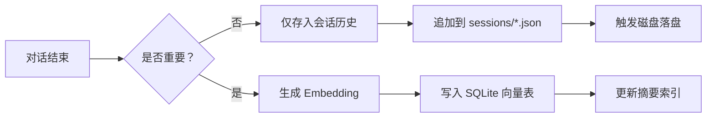

在 OpenClaw 的架构中，**记忆管理（Memory Management）** 是其核心能力之一，旨在平衡 **上下文窗口限制**、**长期知识保留** 与 **隐私安全**。它采用分层存储策略，将记忆分为 **会话记忆（Session）**、**语义记忆（Semantic）** 和 **技能记忆（Skill）** 三层。

以下是 OpenClaw 记忆管理的详细实现机制：

---

## 🧠 三层记忆模型

OpenClaw 不依赖单一的“数据库”，而是根据数据的时效性和用途，采用不同的存储介质和检索策略。

| 记忆层级 | 存储介质 | 生命周期 | 用途  | 检索方式 |
| --- | --- | --- | --- | --- |
| **1\. 会话记忆**<br>(Short-term) | 本地 JSON 文件<br>`sessions/*.json` | 会话期间有效<br>(可配置保留天数) | 保持对话连贯性<br>理解指代关系 | **滑动窗口**<br>按时间顺序加载最近 N 条 |
| **2\. 语义记忆**<br>(Long-term) | SQLite + 向量索引<br>`memory/*.sqlite` | 永久保存<br>(除非手动删除) | 跨会话知识回忆<br>用户偏好/事实存储 | **RAG (向量检索)**<br>相似度搜索 + 关键词过滤 |
| **3\. 技能记忆**<br>(Static) | Markdown 文件<br>`skills/*.md` | 静态配置<br>(版本控制) | 系统指令/工具用法<br>领域专业知识 | **预注入**<br>启动时加载到 System Prompt |

---

## ⚙️ 核心实现机制

### 1️⃣ 写入路径（Ingestion Pipeline）

当 Agent 处理完一轮对话后，记忆写入流程如下：



-   **重要性判断**：Agent 会根据内部指令判断当前信息是否需要长期保存（例如用户提到的名字、偏好、关键任务）。
    
-   **向量化**：使用本地模型（如 `nomic-embed-text`）或 API 将文本转换为向量。
    
-   **原子写入**：利用 `Lane Queue` 串行机制，确保记忆写入不会与工具执行冲突，避免数据竞争。
    

### 2️⃣ 读取路径（Retrieval Pipeline）

在生成回复前，Agent 会组装上下文（Context Assembly）：

1.  **加载系统提示**：读取 `AGENTS.md` 和 `skills/` 下的静态记忆。
    
2.  **检索会话历史**：从 `sessions/` 加载最近 10-20 轮对话（滑动窗口）。
    
3.  **触发语义搜索**：
    
    -   将用户当前 Query 向量化。
        
    -   在 `memory/*.sqlite` 中执行 **混合搜索（Hybrid Search）**：
        
        -   **向量相似度**（Cosine Similarity）：查找语义相关的内容。
            
        -   **BM25 关键词**：确保精确匹配（如订单号、特定名称）。
            
    -   **重排序（Rerank）**：对检索结果进行相关性打分，取 Top-K 注入上下文。
        
4.  **组装 Prompt**：`System + Skills + Recent History + Retrieved Memory + Current Query`。
    

### 3️⃣ 存储后端实现

OpenClaw 默认使用 **SQLite** 作为记忆存储后端，主要出于以下考虑：

-   **单文件便携**：整个记忆库只是一个 `.sqlite` 文件，易于备份和迁移。
    
-   **向量扩展**：利用 `sqlite-vec` 扩展或内置的向量支持，无需部署独立的向量数据库（如 Milvus/Pinecone），降低运维成本。
    
-   **事务安全**：支持 ACID 事务，确保记忆写入不丢失。
    

**表结构示例（简化）：**

```sql
CREATE TABLE memories (
    id TEXT PRIMARY KEY,
    content TEXT,             -- 原始文本
    embedding BLOB,           -- 向量数据
    created_at INTEGER,       -- 时间戳
    session_id TEXT,          -- 来源会话
    tags TEXT                 -- 标签（用于过滤）
);
CREATE INDEX idx_embedding ON memories USING vec0(embedding);
```

---

## 🔒 隐私与安全设计

记忆管理是隐私泄露的高风险区，OpenClaw 采取了以下保护措施：

### 1\. 本地优先（Local-First）

-   所有记忆数据默认存储在用户本地磁盘（`~/.openclaw/`），**不上传云端**。
    
-   即使使用云端 LLM（如 Claude），发送的也仅是当前上下文片段，长期记忆库保留在本地。
    

### 2\. 静态加密（At-Rest Encryption）

-   支持配置 **SQLCipher** 对 SQLite 数据库进行加密。
    
-   密钥由主密码派生，不存储在配置文件中，需启动时输入或通过密钥环（Keychain）获取。
    

### 3\. 记忆隔离（Memory Isolation）

-   **多 Agent 隔离**：不同 Agent（如 `personal` vs `work`）拥有独立的 `memory.sqlite` 文件，防止工作数据泄露给个人助手。
    
-   **会话隔离**：不同渠道（WhatsApp vs Telegram）的会话历史物理隔离，除非显式配置共享记忆。
    

### 4\. 遗忘机制（Right to be Forgotten）

-   提供 CLI 命令 `openclaw memory forget <query>`。
    
-   语义删除：不仅删除匹配的行，还会重新计算相关向量的索引，确保“被遗忘”的信息不会被检索到。
    

---

## 🛠️ 配置与调优

用户可通过 `openclaw.json` 调整记忆行为：

```json5
{
  "memory": {
    "enabled": true,
    "provider": "local-sqlite",  // 或 "pinecone", "pgvector"
    "embeddingModel": "nomic-embed-text",
    "retention": {
      "sessionDays": 30,         // 会话历史保留天数
      "maxContextItems": 50      // 每次检索最大条目数
    },
    "privacy": {
      "encryptDb": true,         // 开启数据库加密
      "piiMasking": true         // 自动脱敏（电话/邮箱）
    }
  }
}
```

### 高级调优策略

1.  **摘要压缩（Summarization）**：
    
    -   当会话历史超过阈值时，触发后台任务，调用 LLM 将旧对话压缩为摘要，释放上下文窗口。
        
2.  **记忆重要性评分**：
    
    -   引入衰减因子，时间越久远的记忆权重越低，除非被频繁检索。
        
3.  **手动标记**：
    
    -   用户可通过特定指令（如 `/remember this`）强制将当前内容存入长期记忆。
        

---

## 🔄 与其他组件的交互

记忆系统不是孤立的，它与 OpenClaw 的其他模块紧密协作：

-   **与 Gateway 交互**：Gateway 负责将不同渠道的消息标准化后，传递给记忆模块进行存储。
    
-   **与 Tool 交互**：某些工具（如 `read_file`）读取的内容可选择性写入记忆；`search_memory` 工具允许 Agent 主动查询长期记忆。
    
-   **与 Lane Queue 交互**：记忆写入操作被放入串行队列，确保在 Agent 思考过程中，记忆状态的一致性（避免读取到“写入中”的脏数据）。
    

---

## 💡 总结

OpenClaw 的记忆管理核心在于 **“本地化、分层化、可控化”**：

1.  **本地化**：利用 SQLite + 本地向量模型，确保数据主权。
    
2.  **分层化**：区分短期会话与长期语义，优化成本与性能。
    
3.  **可控化**：提供加密、隔离和遗忘机制，符合隐私合规要求。
    

这种设计使得 OpenClaw 既能像人类一样拥有“长期记忆”，又避免了云端 AI 助手常见的隐私泄露风险，非常适合处理个人敏感数据或企业私有知识。