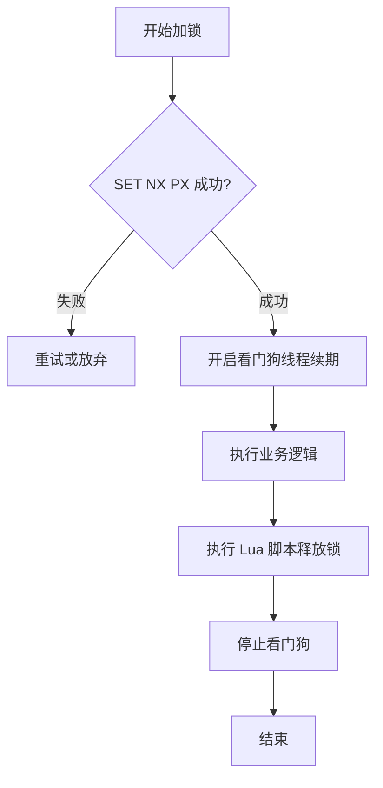

要讲清楚 Redis 分布式锁的流程，不能只说一个 `SET` 命令，而要从**加锁、守锁、释放锁**三个阶段构成的完整闭环来说。

---

### 1\. 核心结论 (Core Conclusion)

一个严谨的 Redis 分布式锁流程必须包含：**原子加锁（SET NX PX）** -> **自动续期（Watchdog）** -> **匹配释放（Lua 脚本）**。 其核心目标是保证在分布式环境下，同一时刻只有一个客户端能持有锁，且不会因为异常导致死锁或误删。

---

### 2\. 详细流程分解 (Detailed Breakdown)

我们将流程分为四个关键步骤：

#### 第一步：申请加锁 (Acquisition)

客户端向 Redis 发送一条特殊的原子命令：

-   **命令**：`SET lock_key unique_id NX PX 30000`
    
-   **参数逻辑**：
    
-   `lock_key`：资源名称。
    
-   `unique_id`：**核心点**。通常用 UUID 或 线程ID，用于标识谁加的锁。
    
-   `NX`：即 "Not Exists"，只有 Key 不存在时才设置成功（保证互斥）。
    
-   `PX 30000`：设置 30 秒自动过期时间（防止持有锁的服务器宕机导致死锁）。
    

#### 第二步：锁的续期 (Watchdog - 守锁)

如果业务逻辑执行时间较长（超过了 30 秒），锁提前过期怎么办？

-   **机制**：当客户端成功拿到锁后，会在后台开启一个**守护线程**（Redisson 中称为 Watchdog）。
    
-   **逻辑**：每隔一段时间（通常是过期时间的 1/3），守护线程会检查业务是否完成。若未完成，则向 Redis 发送命令重置过期时间。这样可以确保只要业务还在跑，锁就不会丢。
    

#### 第三步：业务执行 (Execution)

在锁的保护下，客户端安全地操作共享资源（如数据库扣减库存、订单处理等）。

#### 第四步：释放锁 (Release)

业务完成后，不能直接 `DEL`。

-   **逻辑陷阱**：如果直接 `DEL`，可能会删掉**别人**刚拿到的锁（比如你的锁刚过期，别人拿到了，你再去 DEL 就会误伤）。
    
-   **正确姿势**：使用 **Lua 脚本**。
    

```text
-- 1. 获取锁中的唯一标识
-- 2. 判断是否等于当前客户端传来的标识
-- 3. 如果相等，则删除锁；否则返回失败
if redis.call("get", KEYS[1]) == ARGV[1] then
    return redis.call("del", KEYS[1])
else
    return 0
end
```

**为什么用 Lua**？：因为它能保证“判断”和“删除”这两个动作在 Redis 内部是\*\*原子执行\*\*的。

---

### 3\. 面试官视角 (Interviewer's Lens)    

#### 异常场景模拟：

1.  **追问一：如果redis还没来得及同步到从节点就挂了（主从切换），流程会出现什么问题？**
    
    -   核心回答：这会导致锁丢失。此时线程A认为自己有锁，线程B在新主节点也拿到了说。如果业务要求绝对安全，应该考虑**Redlock（红锁）**或者改用**Zookeeper**。
        
2.  **追问二：如果释放锁的Lua脚本由于网络波动失败了怎么办？**
    
    -   核心回答：没关系。因为我们在加锁时设置了PX过期时间，锁最终会通过超时机制自动释放。
        

---

#### 4\. 流程图解（Logic Flow）



---

### 5\. 总结 (Summary)

1.  **加锁**：必须 `NX` 互斥且带 `PX` 过期，且必须是**原子操作**。
    
2.  **标识**：锁的值必须具有唯一性（UUID），防止**误释放**。
    
3.  **续期**：长耗时任务必须有**续期机制**，防止业务没跑完锁没了。
    
4.  **释放**：必须用 **Lua 脚本** 保证“检查-删除”的原子性。
    

---

**面试官点评：** 能讲清楚这四个步骤，说明你不仅会用，还理解分布式环境下的并发风险。

**接下来，你想试试看“如何手写一个简易的 Redis 分布式锁工具类”吗？或者我们聊聊 Redis 的高并发模型（IO 多路复用**